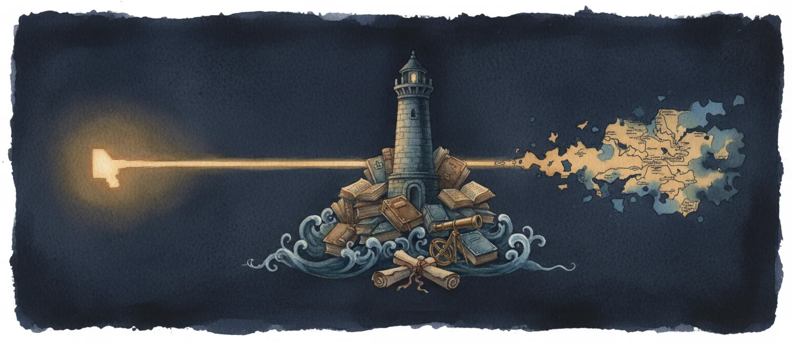
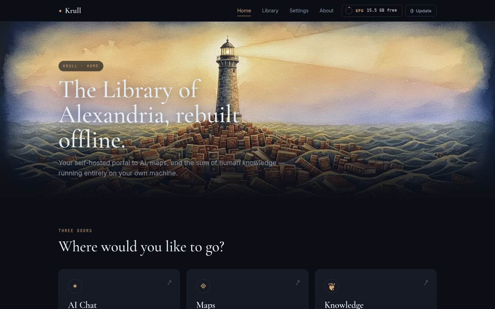

<p align="center">
  
</p>

# Krull AI

**Knowledge, Reasoning, and Unified Local Learning.**

A self-hosted AI workstation that runs entirely on your own hardware. Local language models, an offline map of the world, the sum of human knowledge in ZIM files, and an API gateway that lets [Claude Code](https://claude.ai/code) talk to your local models. No cloud accounts. No API keys. No internet required after setup.

When the network is down, when the company is gone, when the API has been turned off — Krull keeps working.

---

## What's inside

- **A homepage** at `http://localhost:8000` — three big doors to the AI chat, the maps, and the offline knowledge base, plus a Library of Alexandria for browsing and installing knowledge packages and a Settings page for editing your `.env` without touching a terminal.
- **Open WebUI** — browser-based chat with RAG, web search, tools, and pipelines.
- **Ollama** — GPU-accelerated local LLM inference.
- **LiteLLM** — API gateway so Claude Code can talk to local models through the same filters as the chat UI.
- **Offline maps** — terrain, NOAA nautical charts, FAA VFR sectionals, place search, distance measurement.
- **Kiwix** — Wikipedia, Project Gutenberg, Stack Exchange, dev docs, survival manuals — anything you can download as a ZIM.
- **Photon geocoding** and **SearXNG** for search, both running on your machine.

---

## Why Krull exists

Krull bundles a local language model, a beautiful map of the world, and an enormous offline reference library into a single workstation that runs on your hardware. It's designed to be the brain of your projects when you can't or won't depend on someone else's servers.

It's built for people who:

- want to keep coding with Claude Code when the internet disappears
- run AI tools in places with intermittent connectivity (sailboats, RVs, off-grid cabins, field deployments)
- don't want their tools dependent on a credit card and a corporate policy decision
- believe knowledge is worth keeping around in a form that survives the power being out

You shouldn't have to change how you work just because the brain behind it is local. Your existing Claude Code skills, hooks, CLAUDE.md files, and workflows keep working as-is.

---

## Install

### Prerequisites

- **Docker** and **Docker Compose** (v2 plugin)
- **curl**
- **NVIDIA GPU** with `nvidia-container-toolkit` — optional but recommended

The start script checks all of these and tells you exactly what to install for your OS (Arch, Ubuntu, Fedora, macOS).

Everything else — Node.js, bash scripts, model runtimes — ships inside the containers. `./krull download-*` commands are proxied into the `krull-home` container via `docker exec`, so you don't need Node or a Python runtime on the host.

### Clone and start

```bash
git clone git@github.com:odysseyalive/krull-ai.git
cd krull-ai
./krull start
```

First run pulls Docker images (~10 GB), starts every service, and brings up the homepage. Takes a few minutes.

### macOS (Apple Silicon)

On Apple Silicon Macs, Ollama has to run **natively on the host**, not inside Docker. Docker Desktop on macOS runs containers in a Linux VM, and Apple's `Virtualization.framework` does not expose the GPU — so a containerized Ollama would be CPU-only and unusable for anything above a toy model. Run it natively and you get full Metal acceleration.

One-time setup before `./krull start`:

```bash
brew install --cask docker        # Docker Desktop
brew install ollama               # Ollama
ollama serve                      # or: brew services start ollama
./krull start                     # auto-detects macOS
```

`./krull start` detects macOS, points Open WebUI / the SSE proxy / Krull Home at `host.docker.internal:11434`, and pulls your active model through the native daemon.

Two things to know:

- **Models live in `~/.ollama`**, not in this repo's `./data/ollama/`. That's native Ollama's own cache. If you later move this machine to Linux (container mode), you'll re-pull.
- **The hardware panel won't show your GPU.** Krull Home's GPU detector is NVIDIA-only today; on Apple Silicon it reports no GPU. Inference is still fully Metal-accelerated — the panel just can't see it yet.

### Open the homepage

```
http://localhost:8000
```

<p align="center">
  
</p>

That's it. Everything else — pulling a model, installing knowledge packages, downloading maps, editing your `.env`, restarting services — happens from the homepage.

You'll see three doors:

| Door | What it is | URL |
|---|---|---|
| **AI Chat** | Local language models with web search, knowledge lookup, and tool calling | `http://localhost:3000` |
| **Maps** | Offline maps with terrain, nautical, and aeronautical charts | `http://localhost:8070` |
| **Knowledge** | Wikipedia and the Library of Alexandria, served from local ZIM files | `http://localhost:8090` |

Each door opens in a new tab so the homepage stays put.

### Updating Krull

The **Update** button in the top-right of the Krull Home nav (visible on every page) pulls the latest code from GitHub, rebuilds every service, and re-runs setup. Your data, models, maps, and downloaded knowledge are not touched. The page reloads automatically when the new build is ready. You can also run `./scripts/update.sh` from the terminal — both paths do the same thing.

### First things to do

1. **Pick a model.** Open the homepage's **Settings** page. The "Pick a brain" panel at the top has three recommended models — pick the one that fits your GPU (see the table below). Click "Pull & activate" or "Set as active". Krull pulls the model, wires it into the LiteLLM gateway, and restarts the gateway for you.
2. **Install some knowledge.** From the homepage, click **Library of Alexandria**. Browse the Knowledge / Wikipedia / Maps tabs. Click Install on anything that looks useful. The download bar fills, the affected service auto-restarts, and the new content shows up in the corresponding door.
3. **Check your settings.** Below the model picker on the Settings page, every environment variable is editable inline. Click Save; click "Restart affected services" if needed.

### Recommended models

All three are the same Qwen 3.5 Instruct model at different sizes — same architecture, same tool-calling behavior, three VRAM tiers. The "Pick a brain" panel on the Settings page lets you pull and activate any of them with one click.

| Model | VRAM | Best for |
|---|---|---|
| `frob/qwen3.5-instruct:4b` | ~3 GB | Laptops, integrated GPUs, quick prototyping |
| `frob/qwen3.5-instruct:9b` | ~6 GB | **Recommended default.** Daily Claude Code work on a 6–12 GB GPU |
| `frob/qwen3.5-instruct:27b` | ~16 GB | 16+ GB GPUs (RTX 4080/4090, A6000, 7900 XTX) |

> **Why Qwen 3.5 Instruct?** It produces proper Anthropic-style `tool_use` blocks, which Claude Code requires. The `frob/` variant has thinking mode disabled — same weights, same quality, but faster responses without `<think>` blocks. Other models can be installed via `./krull pull-model <name>` and selected by editing `OLLAMA_MODEL` in the Settings page; see [TECHNICAL.md](TECHNICAL.md#pulling-models) for details.

---

## Connecting Claude Code

The first `./krull start` automatically provisions Open WebUI's filters and installs the `krull-claude` launcher to `~/.local/bin/`. After that:

```bash
krull-claude         # launches Claude Code pre-configured to use your local stack
```

Your existing Claude Code skills, plan mode, hooks, and workflows all keep working — Krull plugs in at the model layer.

See [TECHNICAL.md](TECHNICAL.md#using-with-claude-code) for the full Claude Code integration guide, model mapping, and the complete feature compatibility matrix.

---

## When the network goes down

Once everything's downloaded, the entire stack works without internet:

| Component | Offline? |
|---|---|
| LLM inference (Ollama) | Yes |
| Chat UI (Open WebUI) | Yes |
| Map viewer + map search | Yes |
| Wikipedia / knowledge (Kiwix) | Yes |
| Geocoding (Photon) | Yes |
| API gateway (LiteLLM, local models only) | Yes |
| Web search (SearXNG) | Returns empty gracefully |

Nothing crashes when the internet disappears. Web search just returns nothing and the chat carries on.

---

## Where everything lives

All your data stays in local directories under the project root (`data/`, `zim/`). It survives container rebuilds, image updates, and compose changes. You can tear down the whole stack and your models, chat history, maps, and knowledge will still be there when you bring it back up.

---

## More

- **[TECHNICAL.md](TECHNICAL.md)** — Full CLI reference, architecture, filter system, Claude Code integration, GPU notes, and troubleshooting.
- **Issues / contributions** — `https://github.com/odysseyalive/krull-ai`

---

*Krull is named for the warden of a fortress at the end of the world. Yours holds the library inside.*
